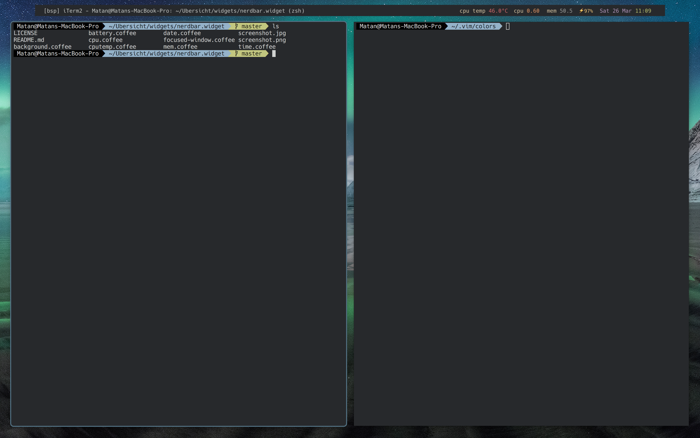

# nerdbar.widget



Übersicht system information bar for use with kwm window manager. Inspired by screenshots of the [kwm window manager](https://github.com/koekeishiya/kwm) and the [authors' NerdTool configuration](https://github.com/koekeishiya/kwm/issues/8#issuecomment-166608067).

In the screenshot above I'm using the excellent [Hack typeface](https://github.com/chrissimpkins/hack).


## Installation

Make sure you have [Übersicht](http://tracesof.net/uebersicht/) installed.

Then clone this repository.

```bash
git clone https://github.com/MatanSilver/nerdbar.widget.git $HOME/Library/Application\ Support/Übersicht/widgets/nerdbar.widget
```

Clone [osx-cpu-temp](https://github.com/lavoiesl/osx-cpu-temp) with:

```bash
git clone https://github.com/lavoiesl/osx-cpu-temp
make
make install
```

And also install the [fontawesome widget](https://github.com/thewellington/fontawesome.widget) to ensure that your status bar can display the FA icons properly.
